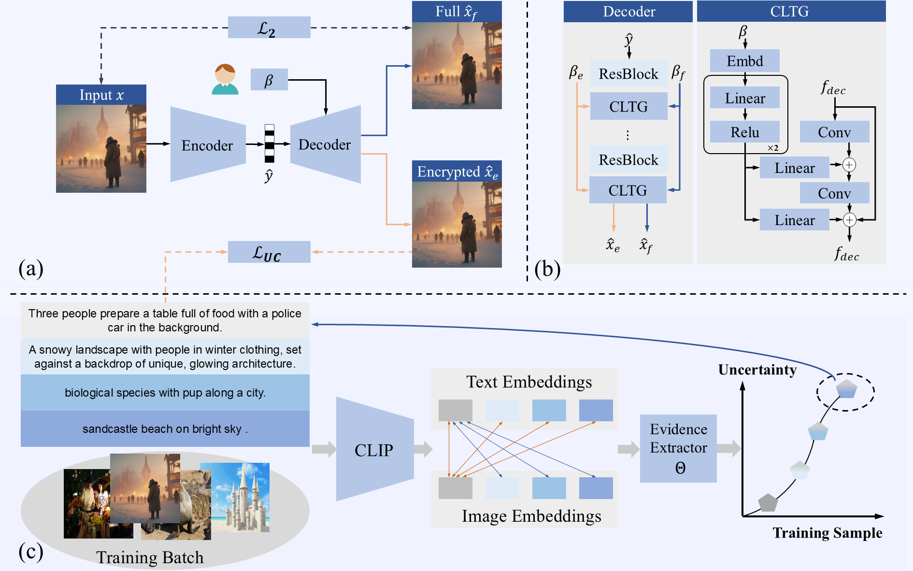

# 🔒 PSIC: Privacy-Shielded Image Compression
> This repo contains the official PyTorch implementation for the paper **''Privacy-Shielded Image Compression: Defending Against Exploitation from Vision-Language Pretrained Models''.**

[](https://github.com/JiayinXu5499/PSIC)
[](LICENSE)
## 🌟 Latest Updates
- **2025-05-01** 🎉 Our paper has been accepted at **ICML 2025**
- **2025-06-22** 🚀 Testing code is now publicly available
- **2025-10-04** 📦 Training code is now publicly available
## 🚀  Approach

<!-- 
[[Paper]](https://arxiv.org/abs/2506.15201)  [[Code]](https://github.com/JiayinXu5499/PSIC)


[](https://arxiv.org/abs/2506.15201)
[](https://github.com/JiayinXu5499/PSIC)


## Weights
<div class="center">
|  | Link |
|:--------:|:--------:|
|PSIC|   [BaiDu Drive](https://pan.baidu.com/s/1JGZ9bZYp1pq4zT4fd8ubQA?pwd=eq7q) |
</div>

## Testing:
### Compress:
Encode and compress the test images, and obtain the decoded images for encoded and the decoded images for protected  from the unified bitstreams.
```python
cd test
python test.py
```
### Retrieval task:
#### Dataset: **Flickr8k** dataset
The performance of decoded images for retrieval task (modify the decoded image path in `test.py`).
```python
cd retrieval
python test.py
```

## Acknowledgments
Thanks [Compressai](https://github.com/InterDigitalInc/CompressAI), [CLIP](https://github.com/openai/CLIP),[BLIP](https://github.com/salesforce/BLIP)for their public code and released models.

## Abstract
The improved semantic understanding of vision-language pretrained (VLP) models has made it increasingly difficult to protect publicly posted images from being exploited by search engines and other similar tools. In this context, this paper seeks to protect users' privacy by implementing defenses at the image compression stage to prevent exploitation. Specifically, we propose a flexible coding method, termed Privacy-Shielded Image Compression (PSIC), that can produce bitstreams with multiple decoding options. By default, the bitstream is decoded to preserve satisfactory perceptual quality while preventing interpretation by VLP models. Our method also retains the original image compression functionality. With a customizable input condition, the proposed scheme can reconstruct the image that preserves its full semantic information. A Conditional Latent Trigger Generation (CLTG) module is proposed to produce bias information based on customizable conditions to guide the decoding process into different reconstructed versions, and an Uncertainty-Aware Encryption-Oriented (UAEO) optimization function is designed to leverage the soft labels inferred from the target VLP model's uncertainty on the training data. This paper further incorporates an adaptive multi-objective optimization strategy to obtain improved encrypting performance and perceptual quality simultaneously within a unified training process. The proposed scheme is plug-and-play and can be seamlessly integrated into most existing Learned Image Compression (LIC) models. Extensive experiments across multiple downstream tasks, along with ablation studies, have demonstrated the effectiveness of our design.-->

## 🛠️ Environment Setup
First, clone this repository and navigate to the project directory:
```bash
git clone https://github.com/JiayinXu5499/PSIC.git
cd PSIC
```
Then, we recommend using Conda to create a virtual environment and install the required dependencies:
```bash
# Create and activate the conda environment
conda create -n psic python=3.8
conda activate psic
# Install PyTorch (please choose the command suitable for your CUDA version)
pip install torch torchvision
# Install other dependencies
pip install compressai==1.2.6
pip install git+https://github.com/openai/CLIP.git
```
**Requirements:**
*   Python 3.7+
*   PyTorch 1.9+
*   CompressAI 1.2.6
*   CLIP 1.0
## 🏁 Quick Start
### 1. Download Pretrained Models

Download our pretrained model weights from the link below. Place them in a `experiments/` folder in the project's root directory (create the folder if it doesn't exist).
| Model | Download Link |
|:---:|:---:|
| **PSIC** | [Baidu Netdisk](https://pan.baidu.com/s/1JGZ9bZYp1pq4zT4fd8ubQA?pwd=eq7q)|
### 2. Testing: Compression & Decompression
We use the **Kodak** dataset to evaluate visual quality.

**Note**: Before running, please make sure to modify the `path` variable in `test/test.py` to correctly read the **Kodak** dataset.

This script will encode and compress the test images. After running, you will obtain a unified bitstream and decode two versions of the images from it:
- **`decoded_img`**: The reconstructed images for normal compression.
- **`protected_img`**: The privacy-shielded image.
```bash
cd test
python test.py
```

### 3. Evaluation: Image Retrieval Task

We use the **Flickr8k** dataset to evaluate the privacy protection effect. This script evaluates the performance of the `protected_img` on the image retrieval task to verify its privacy-preserving capabilities.

**Note**: Before running, please make sure to modify the `decoded_image_path` variable in `retrieval/test.py` to point to the directory containing the `protected_img` files you generated in the previous step.

```bash
cd retrieval
python test.py
```
## 🔧 Training
### Step 1: Focus on Visual Quality
Take the first compression level as an example:
```bash
cd PSIC/train
python train_f.py --experiment mse0011 --metrics mse --lambda 0.0011 --lambda_beta0 0.0011 --lambda_beta1 0.0011 --lambda_clip 0.0009 --num-workers 8 --seed 2000 --batch-size 128 --test-batch-size 128
```
### Step 2: Emphasize Privacy Protection
```bash
python train_s.py --experiment mseq10011 --epochs 100 --learning-rate 1e-5 --lambda 0.01 --batch-size 64 --checkpoint experiments/mse0011/checkpoint_best_loss.pth.tar --lambda_clip 0.07 --lambda_beta0 0.0011 --lambda_beta1 0.0011 
```
## 🙏 Acknowledgements
Our implementation is based on [CompressAI](https://github.com/InterDigitalInc/CompressAI), [CLIP](https://github.com/openai/CLIP) and [BLIP](https://github.com/salesforce/BLIP). We thank the authors for their excellent open-source projects.


